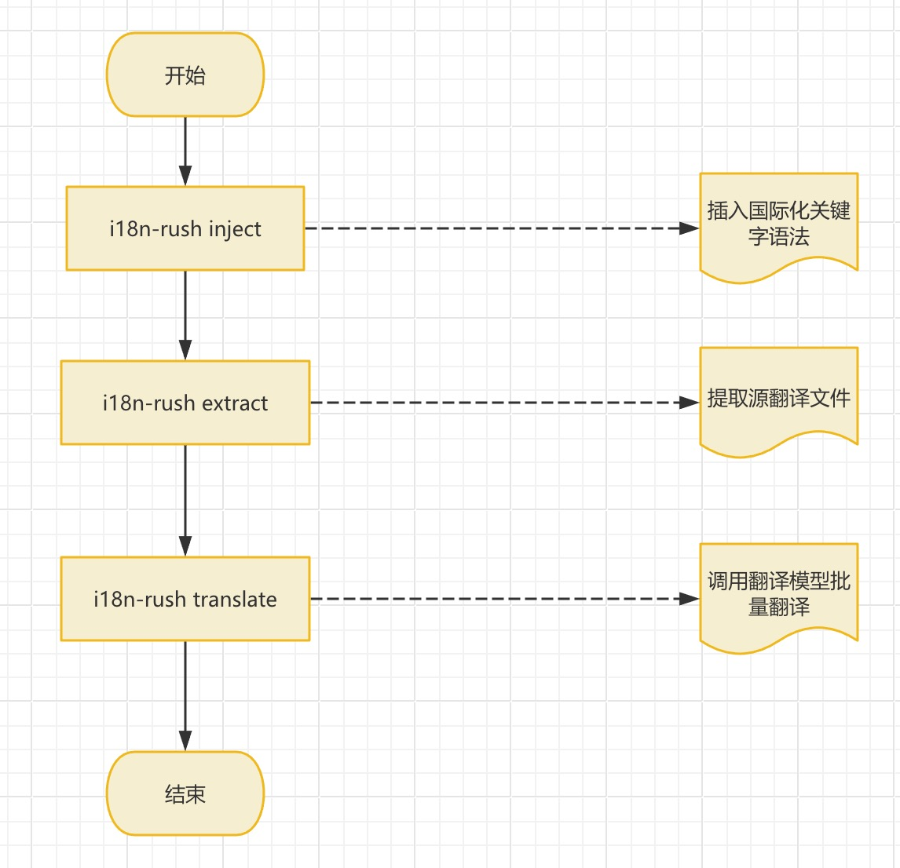

# I18nRush

帮助Angular、React项目快速实现国际化

支持的国际化库：

- [x] @angular/localize
- [x] i18next
- [x] react-i18next
- [ ] ng-translate

功能点：

- 给使用中文文本的地方插入i18n key
- 提取出源翻译文件
- 调用翻译模型翻译并生成文件

流程图：



## 安装

```
npm install -g i18n-rush
i18n-rush -h
```

或直接使用npx

```
npx i18n-rush [options] [command]
```

## CLI

### inject i18n key

```
i18n-rush inject --path ./src --framework react --library react-i18next
```

### extract i18n

根据i18n key提取翻译文件，根据对应的国际化库使用现成工具即可

```
i18n-rush extract --path ./src --output ./src/locales --framework react --library react-i18next
```

### translate

从`huggingface`下载翻译模型进行翻译，生成目标翻译文件

```
i18n-rush translate --source ./src/locales/zh.json --target ./locales/en.json --targetLanguage en --format json --proxy http://127.0.0.1:7897
```

